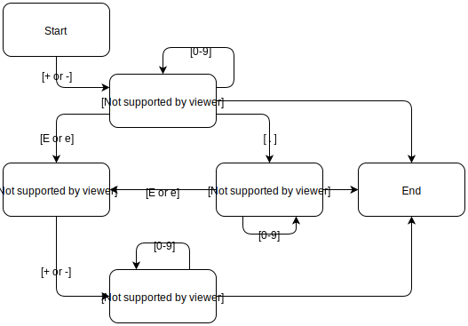
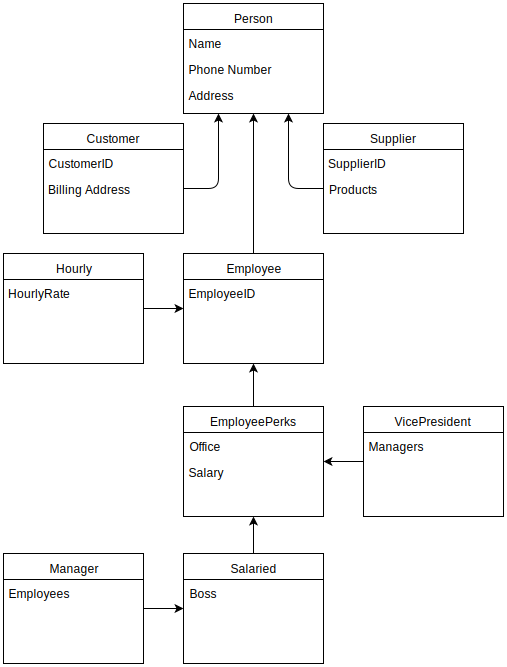

# Reading Assignment 2

**Problem 5.1**
:  What's the difference between a component-based architecture and a service-oriented architecture?

>A component-based architecture sees the pieces of the system as loosely related; they provide services for each other. A service-oriented architecture is similar except the pieces are implemented as services, often running on separate computers communicating across a network. The two are similar, but the pieces are more separated in a service-oriented architecture.

**Problem 5.2**
: Suppose you're building a phone application that lets you play tic-tac-toe against a simple computer opponent. It will display high scores stored on the phone, not in an external database. Which architectures would be most appropriate and why?

>This is a simple, self-contained application so no remote services or database is required. That means client-server, multi-tier, component-based, and service-oriented architectures are probably overkill. You could use them internally within the phone, but a simple computer opponent probably isn’t complicated enough to make them necessary.
</br></br>
For this application, a monolithic architecture would probably work well because it’s a relatively small, self-contained application.
</br></br>
A data-centric approach also works well in this example. For tic-tac-toe in particular, it’s easy to build tables of moves and the best responses, so it will probably use some data- centric or rule-based techniques.
</br></br>
The user interface will be event-driven, at least in terms of responding to user events. You could also make the computer opponent raise events when it makes moves, so you might make that part of the system event-driven, too. However, for this simple application that’s probably not necessary.
</br></br>
Finally, you could use distributed components to make different processes explore different sequences of moves simultaneously, but again tic-tac-toe just isn’t that complicated an application, so it’s probably not necessary.
</br></br>
In conclusion, this application would probably be easiest to build as a simple monolithic rule-based (data-centric) application.

**Problem 5.4**
: Repeat question 3 [after thinking about it; it repeats question 2 for a chess game] assuming the chess program lets two users play against each other over an Internet connection.

>This scenario may seem a lot more complicated than the previous one, but it’s not too bad. The user interface is basically the same. The only changes are: (1) The program needs to exchange information with another instance of the program across the Internet, and (2) There’s no computer opponent.
</br></br>
Removing the computer opponent means the program doesn’t need distributed pieces.
</br></br>
You could use web services to allow two programs to communicate over the Internet. That would make the application a monolithic rule-based (data-centric) service-oriented application.

**Problem 5.6**
: What kind of database structure and maintenance should the ```ClassyDraw``` application use?

>The ClassyDraw application can store each drawing in a separate file, so it doesn’t need much of a database. Operating system tools can let the user manage files. For example, they let the user delete old files and make backup copies of files.
</br></br>
The program could create a temporary file while the user is editing a drawing. Then if the program crashes or is ended prematurely, it could ask the user if it should restore the temporary file the next time it starts.

**Problem 5.8**
: Draw a state machine diagram to let a program read floating point numbers in scientific notation as in +37 or -12.3e+17 (which means -12.3 x 10<sup>17</sup>). Allow both E and e for the exponent symbol. [Jeez, is this like Dr. Dorin's DFAs, or what???]

>Floating Point Numbers State Diagram <br>


**Problem 6.1**
: Consider the ```ClassyDraw``` classes ```Line```, ```Rectangle```, ```Ellipse```, ```Star```, and ```Text```. What properties do these classes all share? What properties do they not share? Are there any properties shared by some classes and not others? Where should the shared and non-shared properties be implemented?

>The ```Line```, ```Rectangle```, ```Ellipse```, ```Star```, and ```Text``` classes all require extra parameters such as outline color, background color, position, height, and width. Furthermore, ```Text``` requires such parameters as font size, font type, and string. The ```Star``` class might need the number of points needed to draw a particular star shape. Moreover, the classes ```Rectangle```, ```Ellipse```, and ```Star``` may be filled with a specific color whereas the rest of the classes may not. Finally, the line thickness and line style may be specified for the classes ```Line```, ```Rectangle```, ```Ellipse```, and ```Star```. The shared properties would be superclasses, and the non-shared properties would be enclosed inside classes that have no subclass.

**Problem 6.2**
: Draw an inheritance diagram showing the properties you identified for Exercise 1. (Create parent classes as needed, and don't forget the ```Drawable``` class at the top.)

>mor hlep psls

**Problem 6.3**
: The following list gives the properties of several business-oriented classes.
* Customer — Name, Phone, Address, BillingAddress, CustomerID
* Hourly — Name, Phone, Address, EmployeeID, HourlyRate
* Manager — Name, Phone, Address, EmployeeID, Office, Salary, Boss, Employees
* Salaried — Name, Phone, Address, EmployeeID, Office, Salary, Boss
* Supplier — Name, Phone, Address, Products, SupplierID
* VicePresident — Name, Phone, Address, EmployeeID, Office, Salary, Managers
<br><br>
Assuming a ```Supplier``` is someone who supplies products for your business, draw an inheritance diagram showing the relationships among these classes. (Hint: Add extra classes if necessary.)

>A ```Person``` class can hold the properties _Name_, _Phone_, _Address_ and can be a superclass of ```Customer```, ```Employee```, and ```Supplier``` since these classes all share the said properties. Likewise, the classes ```Salaried```, ```VicePresident```, and ```Manager``` share the properties _Office_ and _Salary_. However, only the VicePresident has the property _Managers_ and ```Salaried``` does not have the _Employees_ property so an extra class, ```EmployeePerks``` can be a superclass of both ```Salaried``` and ```VicePresident``` and ```Manager``` will be a subclass of ```Salaried```.
<br><br>
Floating Point Numbers State Diagram <br>


**Problem 6.6**
: Suppose your company has many managerial types such as department manager, project manager, and division manager. You also have multiple levels of vice president, some of whom report to other manager types. How could you combine the ```Salaried```, ```Manager```, and ```VicePresident``` types you used in Exercise 3? Draw the new inheritance hierarchy.

>The properties _Office_, _Salary_, _Boss_, and _Employees_ can be combined into a single class, ```Salaried```. For a ```VicePresident``` with no bosses, the ```Boss``` property would be empty. Additionally, the _Employees_ property would also be empty for employees who are not ```Managers```. <br><br>
oh god another diagram
